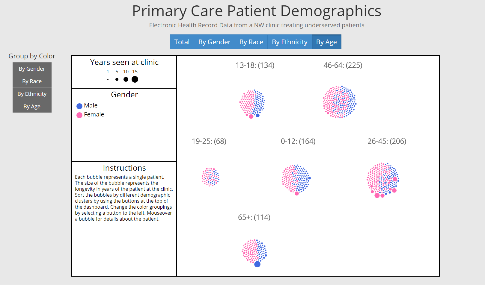
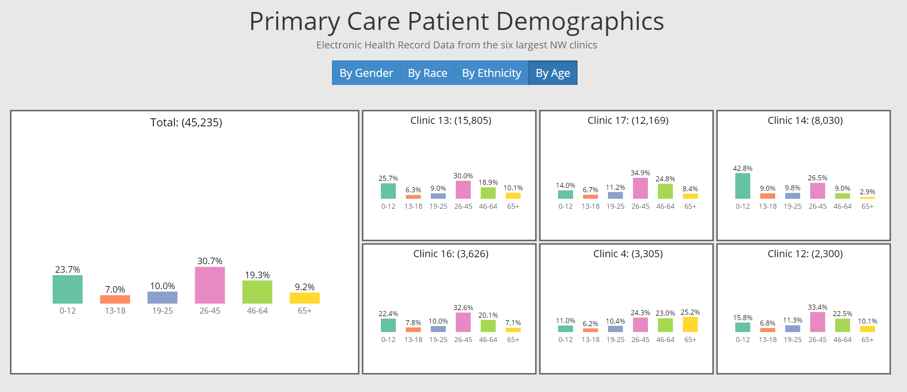

Visualization Prototype Development to Demonstrate the Breadth and Depth of Electronic Health Record Data 
===============
#### Collaborators: Ahmad Aljadaan, Ross Lordon, Jacob Olsufka

After a bit of a delay, due to the logistics of obtaining the de-identified clinical data, we were able to begin developing our prototypes on May 26th. The main goal of our project was to develop a variety of data visualization methodologies to improve upon the ones currently on the Data QUEST Institute of Translational Health Sciences (ITHS) website. In light of this, we as a group decided to each individually develop a different visualization utilizing a different methodology. This would ensure that the work was divided up equally. Additionally, we worked on the paper and poster collaboratively. 

===============
###Abstract

In this project we assessed the current state of medical data visualization practices and standards. Limited research has been conducted in regards to medical data visualization techniques, standards, or applications. Subsequently we created prototype data visualizations depicting population level electronic health record data for the UW ITHS Data QUEST team. The Data QUEST team has an immediate need for improved data visualization and interactions on their website. In light of this, we opted to develop three different visualization prototypes. The purpose of each is to allow researchers to quickly and effectively explore the data, while informing potential research questions or projects. In the future, these prototypes will be assessed and refined by the Data QUEST team. Ultimately the visualizations will be incorporated into their redesigned website this fall.

===============
###Prototype Screenshots
####Force Bubble Diagram

###### The force bubble diagram allows the user to explore the breadth and depth of the data in regards to the patients’ demographics. The purpose is to facilitate exploratory data analysis in a fun and engaging experience. It is our hope that this tool creates increased interest from a researcher looking to learn more about the dataset available. This interactive chart allows for two simultaneous user inputs for analysis. First, the bubbles can be sorted by the same demographic categories listed above for the small multiples visualization. Second, the user can color the dots to depict the distribution of a second demographic variable within the clusters of the first demographic variable selected. The size of the bubbles represents the longevity of each patient’s time seen at the clinic. Details on demand are provided to the user through mouse over.

####Small Multiples Bar Charts

###### One visualization method we pursued consisted of a small multiple approach to compare between clinics using bar charts. The purpose of this visualization is to allow researchers the ability quickly assess the demographics of all the clinics combined and for each individual clinic selected for analysis. The demographics included in the prototype are gender, race, ethnicity, and age. One larger multiple is displayed on the left hand side depicting the total for all the clinics currently being analyzed to the right of the larger multiple are the smaller multiples depicting the breakdown of the smaller clinics. Mouse over is incorporated into each bar in each chart to provide details on demand to the user.

####Stacked Bar Chart

###### The stacked bar chart visualization allows the user to navigate the clinical data for specific disease for different years. This display allows the user to navigate through the aggregate data by number of patients. This is accomplished by selecting from the same demographic options used in the previous examples. Users may find patterns that occurred during a specific time frame for a certain demographic diagnosed with a specific disease. For example, if a user wanted to see if more males than females were diagnosed with depression from 2012-2014, this visualization could help researchers answer the question.

===============
### Links
[Poster](https://github.com/CSE512-15S/fp-aljadaan-rlordon-olsufj/blob/master/Poster-Big.png) || [Paper](https://github.com/CSE512-15S/fp-aljadaan-rlordon-olsufj/blob/master/final/paper-aljadaan-rlordon-olsufj.pdf)

===============
### Running Instructions

To open the visualizations, [please click here](https://cse512-15s.github.io/fp-aljadaan-rlordon-olsufj/)

